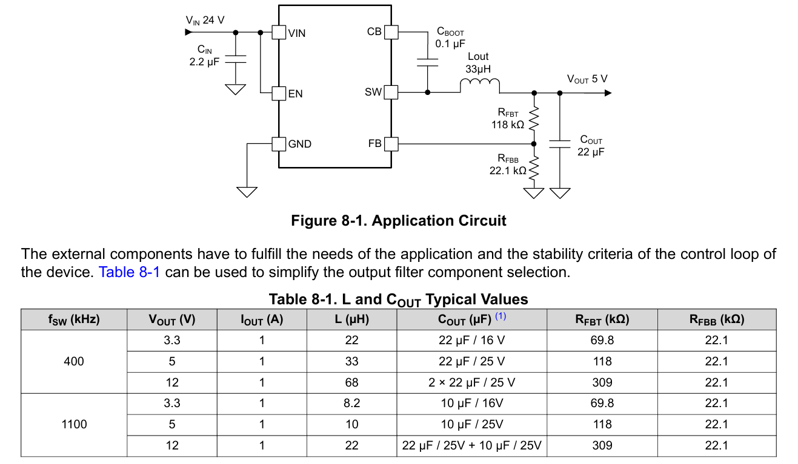
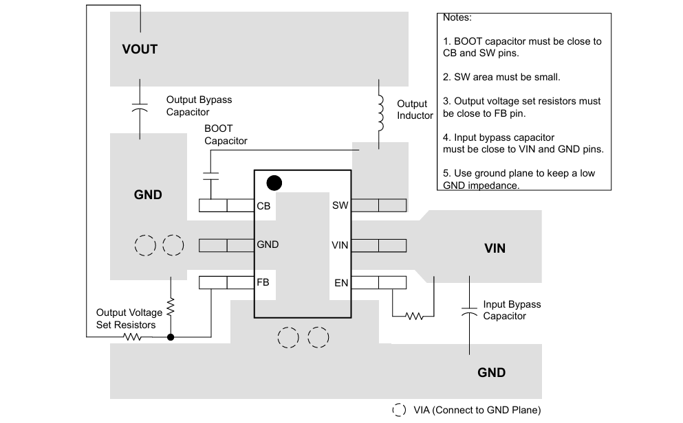

# Buck converter

**References:**
>- [How switching frequency affects performance](https://www.ti.com/lit/an/slvaed3a/slvaed3a.pdf?ts=1782647792501&ref_url=https%253A%252F%252Fwww.google.com%252F)
>- [LMR51610 datasheet](https://www.ti.com/lit/ds/symlink/lmr51610.pdf?ts=1782609124824&ref_url=https%253A%252F%252Fwww.ti.com%252Fproduct%252FLMR51610%252Fpart-details%252FLMR51610YFDBVR%253FkeyMatch%253DLMR51610Y%2526tisearch%253Duniversal_search)
>- [Buck converter output limitations](https://www.ti.com/lit/an/slyt293/slyt293.pdf?ts=1782683380074)

## Efficient step down converter

The battery DC bus has to be stepped down from +29V to +3.3/5V for the analog electronics and MCU. Due to the large difference in voltage, an efficient buck conveter has to be chosen.

A buck converter is the superior choice compared to linear voltage regulators when the difference in voltage levels are large. Buck converters are switching regulators with efficiency exceeding 90%, while linear regulators dissipate excess power as heat and is only about 30-50% efficient.

## Buck IC selection

| Part                        | Use it when                                                  | Pros                                                                    | Cons                                                      |
| --------------------------- | ------------------------------------------------------------ | ----------------------------------------------------------------------- | --------------------------------------------------------- |
| **LMR51610XDBVR**           | Best general choice for STM32 + CAN/RS-485                   | 65 V input margin, 1 A, 6 pins, modern synchronous buck                 | SOT-23 is small, though still hand-solderable             |
| **LMR51606XDBVR**           | Load is definitely below ~500–600 mA                         | Same family, lower-current version                                      | Less headroom for peripherals                             |
| **LM2675-5.0 / LM2675-3.3** | You want easiest hand soldering                              | 8-pin SOIC or PDIP, 40 V input, fixed 5 V/3.3 V versions, simple design | Older, needs external diode, larger inductor/caps         |
| **LM2596**                  | Board space is not an issue and you want very easy soldering | 5-pin TO-220/TO-263, 3 A, easy to prototype                             | Old, 150 kHz, bulky parts, more heat                      |
| **LMR51430**                | You need up to 3 A but still want 6 pins                     | 3 A, 6-pin SOT-23, simple                                               | 36 V max input, less margin on a 30 V rail                |
| **LMR38010-Q1**             | Your 30 V rail may have spikes/transients                    | 80 V input, 1 A, automotive/industrial style part                       | 8-pin HSOIC PowerPAD, not as solder-friendly as SOIC/PDIP |

**Final selection: LMR51610XDBVR**

## LMR51610XDBVR application

### Switching frequency

The higher switching frequency allows for lower value inductors and smaller output capacitors, which results in smaller design size and lower component cost. However, higher switching frequency brings more switching loss, making the design less efficient and produce more heat. 

400kHz was chosen to balance noise and switching efficiency. External component size is not a concern here.

### Inductor selection

The ripple current $\Delta i_L$ is given by:

$$
\Delta i_L = \frac{V_{\text{out}}\cdot (V_{\text{In-max}} - V_{\text{out}})}{V_{\text{In-max}}\cdot L \cdot f_{\text{SW}}}
$$

With 30V in max, 3.3V out, $L=22\mu H$, $f_{\text{SW}}=400\text{kHz}$,

$$
\begin{align}
\Delta i_L &= \frac{3.3\cdot (30-3.3)}{30\cdot 22\times 10^{-6} \cdot 400 \times 10^{3}} \\[12pt]
&\approx 0.33A
\end{align}
$$

Peak current: max. 1A + 0.33A ripple = 1.33A.

The datasheet suggests an inductor saturation higher than the peak current limit level of the converter, which is listed as $\text{IHS-PK(OC)}=1.95A$.

The datasheet also suggest a low DCR (DC resistance) of $\le 150m\Omega$. The recommended ratings are:
- 1.5A RMS
- 2.5A Saturation
- $\le 150m\Omega$ DCR

## PCB layout guide

