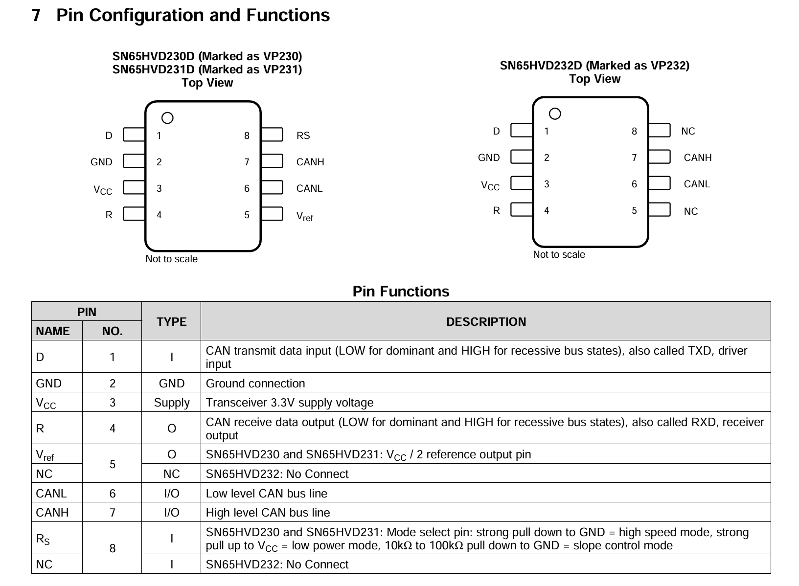
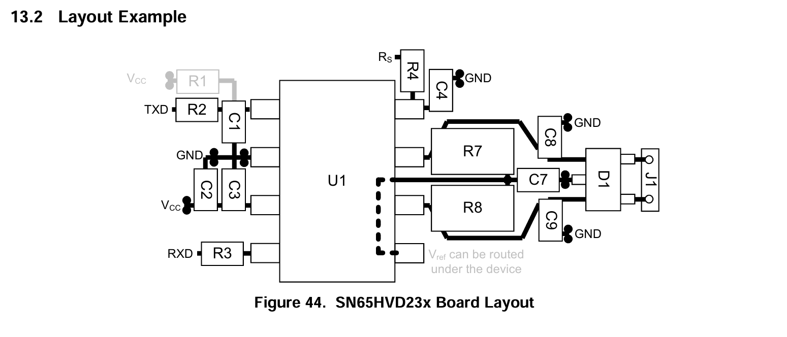

# SN65HVD230 transceiver

**TL;DR:**
>SN65HVD230 CAN transceiver shematic design. DPST-switch toggled split termination to ground.

**References:**
>- [SN65HVD230 datasheet](https://www.ti.com/lit/ds/symlink/sn65hvd230.pdf?ts=1782171621415&ref_url=https%253A%252F%252Fwww.ti.com%252Flit%252Fgpn%252Fsn65hvd230)

## Pinout

## Termination

The CAN bus has to be terminated at the extreme nodes by conecting a $120\Omega$ resistor between `CANH` and `CANL` to eliminate signal reflection.

A more robust approach is to connect `CANH` and `CANL` seperately to $V_{cc}/2$ or ground through $60\Omega$ resistors. This configuration is also called split termination.

Split termination to $V_{cc}/2$ bias the split node to $V_{ref}$ and holds the bus common-mode voltage at a defined level. However, SN65HVD230's weak drive on the $V_{ref}$  pin makes it marginal for sinking real termination current. Hence, cap-to-GND approach is generally preferred.

### Termination toggle

The split termination resistors can be connected/disconnected using a DPST switch.

## PCB layout reference

