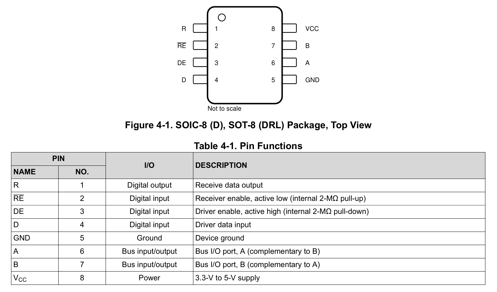
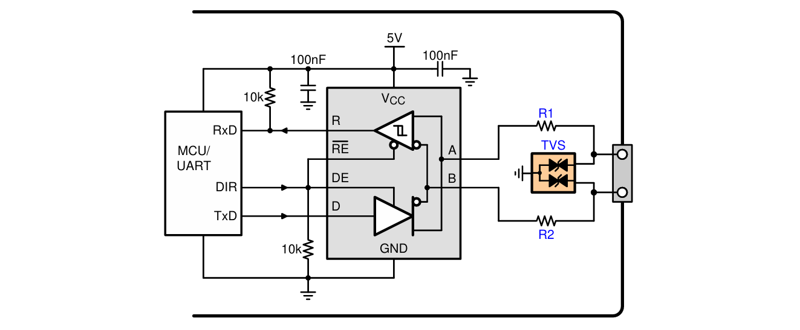
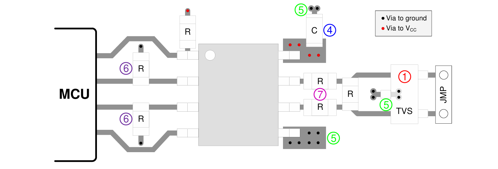

# THVD1400D 

**TL;DR:**
>Design considerations for the THVD1400D serial to RS485 transceiver.

**References:**
>- [THVD1400D datasheet](https://www.ti.com/lit/ds/symlink/thvd1400.pdf?ts=1782266824050)
>- [SM712 TVS diode array datasheet](https://www.littelfuse.com/assetdocs/tvs-diode-array-spa-sm712-datasheet?assetguid=8313a28c-8802-4d47-a2a7-e30b5b1f67d8)
>- [Arduino UART guide](https://docs.arduino.cc/learn/communication/uart/)

## Pinout

## Application shematic

### 1) TVS protection
The datasheet recommends the addition of an external TVS protection circuitry.

SM712 is the industrial standard for RS485 TVS suppression as it offers asymmetrical clamping voltages (-7V to +12V).

### 2) `DE, RE` pulldown

The application note suggests that the `DE` and `RE` pins are pulled down through a $10k\Omega$ resistor.

This sets the transceiver in a "disabled, listener" state by default to prevent accidental bus contention.

### 3) `RxD` pullup

The serial data output line from the transceiver `RxD` is pulled high to set the default state as idle (serial start bit is always logic level low, high is idle).

### 4) Pulse-proof resistors 

$10\Omega$ pulse-proof thick-film resistors are placed in series with the RS485 A/B lines to limit transient surge current and absorb residual transient energy.

## Layout

1. Place the protection circuitry close to the bus connector to prevent noise transients from propagating across the board.
   
2. Use VCC and ground planes to provide low inductance. Note that high-frequency currents tend to follow the 
path of least impedance and not the path of least resistance.

3. Design the protection components into the direction of the signal path. Do not force the transient currents to 
divert from the signal path to reach the protection device.

4. Apply 100-nF to 220-nF decoupling capacitors as close as possible to the VCC pins of transceiver, UART 
and/or controller ICs on the board.

5. Use at least two vias for VCC and ground connections of decoupling capacitors and protection devices to 
minimize effective via inductance.

6. Use 1-kΩ to 10-kΩ pull-up and pull-down resistors for enable lines to limit noise currents in these lines during 
transient events.

7. Insert pulse-proof resistors into the A and B bus lines if the TVS clamping voltage is higher than the specified 
maximum voltage of the transceiver bus pins. These resistors limit the residual clamping current into the 
transceiver and prevent it from latching up.

8. While pure TVS protection is sufficient for surge transients up to 1 kV, higher transients require metal-oxide varistors (MOVs) which reduce the transients to a few hundred volts of clamping voltage, and transient 
blocking units (TBUs) that limit transient current to less than 1 mA.

