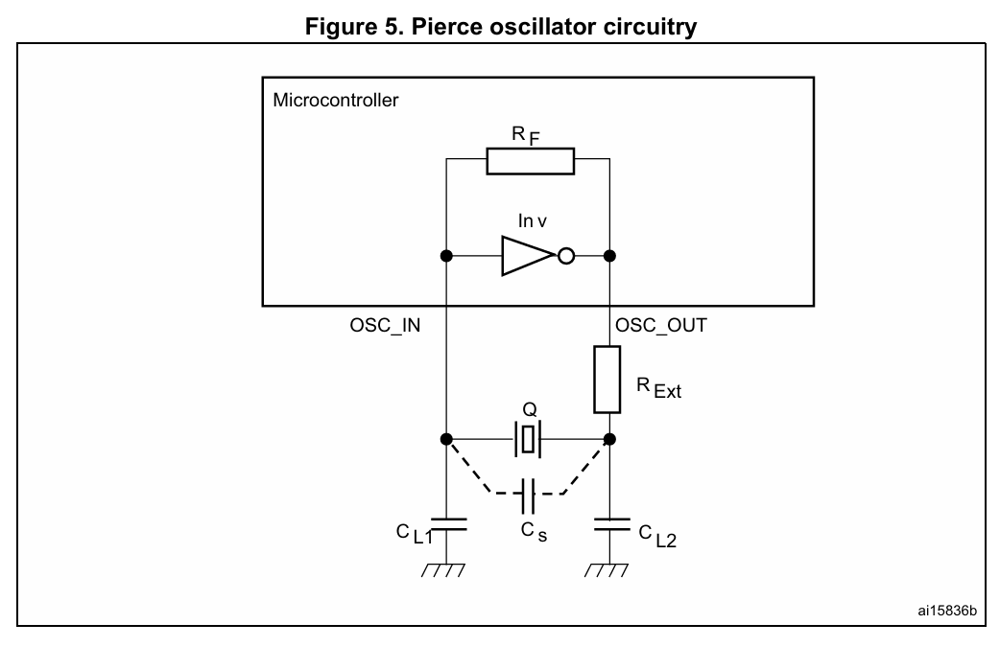
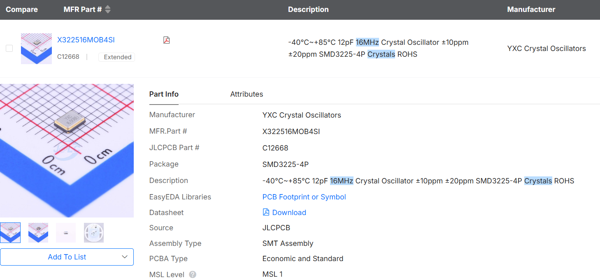

# Crystal oscillator design

**TL;DR:**
>Research on crystal oscillator circuit design. Load capacitors calculated to be $14\text{pF}$.

**References:**
>- [Oscillator design application note](https://www.st.com/resource/en/application_note/an2867-guidelines-for-oscillator-design-on-stm8afals-and-stm32-mcusmpus-stmicroelectronics.pdf)
>- [Phil's lab STM32 pcb design](https://www.youtube.com/watch?v=aVUqaB0IMh4&t=3115s)

## Load capacitance

Quoting STM32 oscillator design application note `AN2867`:
>The load capacitance is the terminal capacitance of the circuit connected to the crystal oscillator. This value is determined by the external capacitors CL1 and CL2, and the stray capacitance of the printed circuit board and connections (Cs). 
>
>For the frequency to be accurate, the oscillator circuit must show the same load capacitance to the crystal as the one the crystal was adjusted for. The external capacitors CL1 and CL2 are used to tune the desired value of CL, to reach the value specified by the crystal manufacturer.

Formula:

$$
C_{L}=\frac{C_{L1}\cdot C_{L2}}{C_{L1} + C_{L2}}+C_S
$$

In practice, the required capacitance $C_{L1} = C_{L2}$ can be estimated by:

$$
C_{L1} = C_{L2} = 2\times (C_L-C_S)
$$

The stray capacitance $C_S$ is notoriously hard to calculate accurately, so it is commonly estimated to be in the range of $2-5\text{pF}$.

Below is the chosen SMD crystal oscillator (16MHz):

The manufacturer specifies a tuned load capacitance of $12pF$. We assume a stray capacitance of $5\text{pF}$. Hence, $C_{L1},C_{L2}$ can be calculated:

$$
\begin{align}
C_{L1} = C_{L2} &= 2\times (C_L-C_S) \\
&= 2\times (12-5) \\
&= 14\text{pF}
\end{align}
$$

