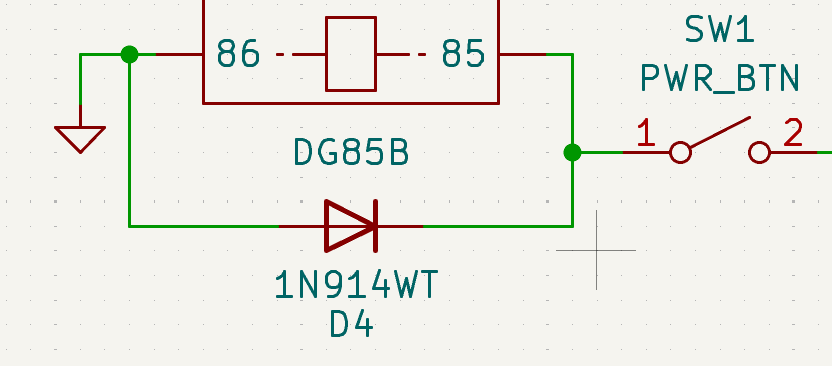
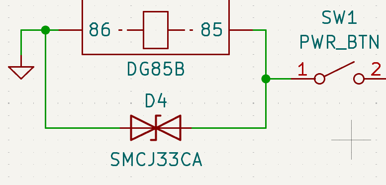

# Relay flyback protection

**TL;DR:**
>The coil in a relay acts as an inductor capable to inducing a large forward current the moment it is switched off. A normal diode or TVS diode could be used to recirculate and dissipate this energy, with the latter giving a much faster response time.

**References:**
>- [How to select surge diode](https://www.ti.com/lit/an/slvae37/slvae37.pdf?ts=1782528231635)
>- [Application of Relay Coil Suppression with DC Relays](https://www.te.com/en/products/relays-and-contactors/electromechanical-relays/intersection/relay-coil-suppression-dc-relays.html?utm_source=chatgpt.com&tab=pgp-story)

## Relay flyback diode 

A flyback diode is placed across the coils of the relays. The electromagnetic core of the relay acts like a inductor and stores energy in the form of the magnetic field when powered. Turning the relay off collapses the magnetic field and induces a reverse current that has to go somewhere.

The voltage induced in the inductor is given by:

$$
v(t)=L\frac{di}{dt}
$$

When power to the coil is cut abruptly, the current tries to drop to 0 instantaneously. The large rate of change of current induces extreme voltages reaching upwards of 1500V for a very short period of time.

A flyback diode is used to re-circulate and dissipate this induced current and protect other components around it. 

## Regular diode

A standard diode could be placed across the coil terminals to help recirculate and dissipate the stored energy.

The voltage drop dictates how quickly the diode is able to dissipate the energy (no voltage drop = no resistance = 0 energy dissipated as heat).The voltage drop across a standard diode is only about 0.7V, hence the induced current has to recirculate multiple times before being fully dissipated.

The small voltage drop leads to a delay in the relay contacts closing as the coil loses its magnetism slower.

## Bidirectional TVS diode

A TVS allows a much higher clamp voltage, so the inductor current decays faster. The `SMCJ33CA` bi-directional TVS diode used above has a breakdown voltage of 33V and a clamping voltage of 53.3V.

During normal operations, the voltage is around 26-29V depending on battery charge. Since this is less than the 33V breakdown voltage, the diode remains invisible to the circuit.

When the coil current path is interrupted, the coil generates a voltage spike large enough to drive the TVS into breakdown, where it safely clamps the voltage to $<53.3V$ and dissipates the stored energy quickly.

The large clamping voltage allows the relay to de-energize much faster than using a normal diode.
