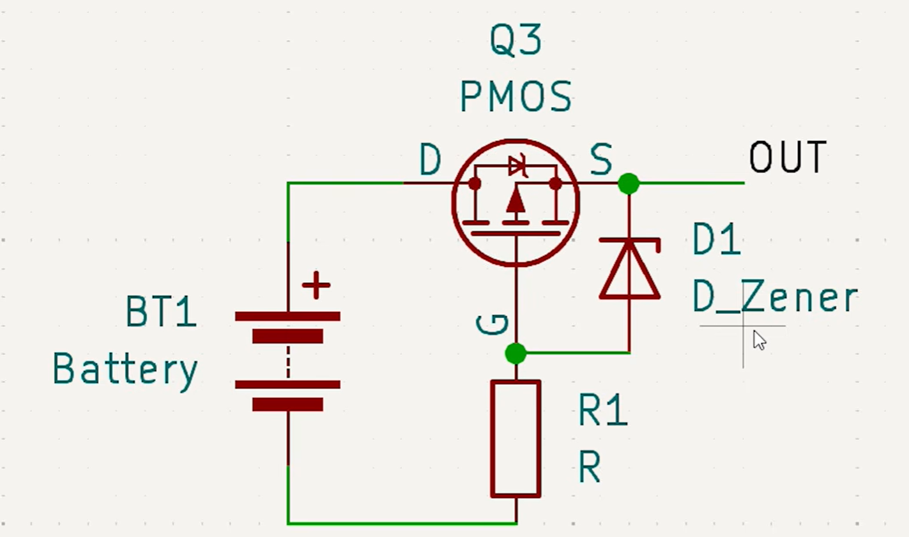
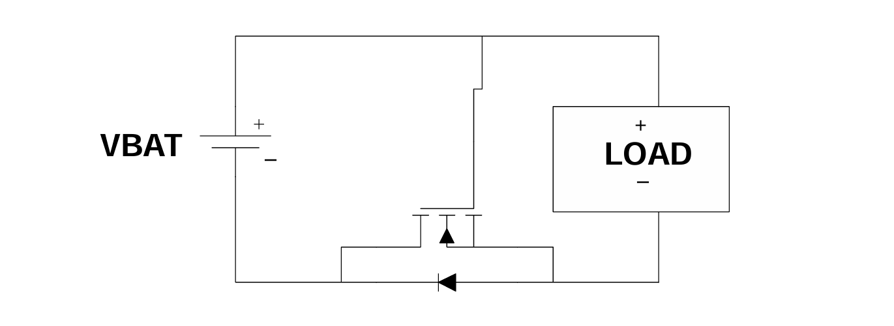
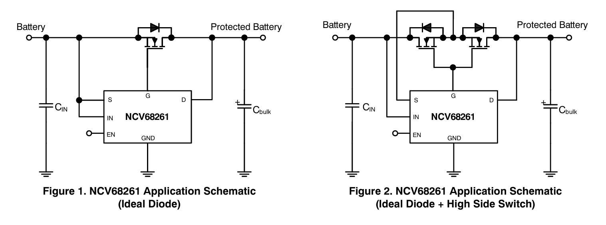
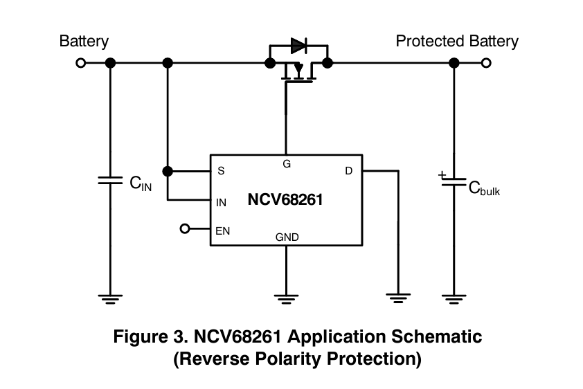

# Reverse polarity protection

**References:**
>- [TI reverse polarity protection comparison](https://www.ti.com/document-viewer/lit/html/SSZTBS3)
>- [Design of reverse polarity circuit](https://www.monolithicpower.com/learning/resources/designing-a-reverse-polarity-protection-circuit-part-i)
>- [Electronics stack exchange reverse polarity protection](https://electronics.stackexchange.com/questions/622942/is-reverse-polarity-protection-this-simple)
>- [TI reverse current protection circuits](https://www.ti.com/lit/an/slva139/slva139.pdf?ts=1782282569398&ref_url=https%253A%252F%252Fwww.google.com%252F)
>- [NCV68261 datasheet](https://www.onsemi.com/download/data-sheet/pdf/ncv68261-d.pdf)
>- [LM5060 datasheet](https://www.ti.com/lit/ds/symlink/lm5060-q1.pdf?ts=1782357004916&ref_url=https%253A%252F%252Fwww.google.com%252F)
>- [NVEP6090 MOSFET datasheet](https://uploadcdn.oneyac.com/attachments/files/brand_pdf/ncepower/NCEP6090.pdf)
>- [SMCJ33A TVS diode](https://www.st.com/resource/en/datasheet/smcj12a.pdf)

## Methods

### 1) Series schottky diode

The simplest method is to just place a schottky diode in series. However, this is only suitable for low power applications with <3A max current.

### 2) FET

The most recent MOSFETs are very low on resistances, and therefore, are ideal for providing reverse current protection with minimal loss.

#### High side P-FET

A high side P-channel MOSFET can be used with the gate pulled to ground. A P-FET switches on when the gate voltage is more negative than the source, so when the input is reversed the gate is driven to +VIN and source to 0V, turning off the MOSFET.

A zener diode and resistor is usually placed to limit the gate current and voltage to prevent permanent damage to the MOSFET.

#### Low side N-FET

### 3) High side protection controller IC

A dedicated IC could be used to control a high-side N-FET to conduct with ultra-low losses and turn off the MOSFET the moment the internal comparator monitoring the voltage differential is tripped.

## NCV68261

