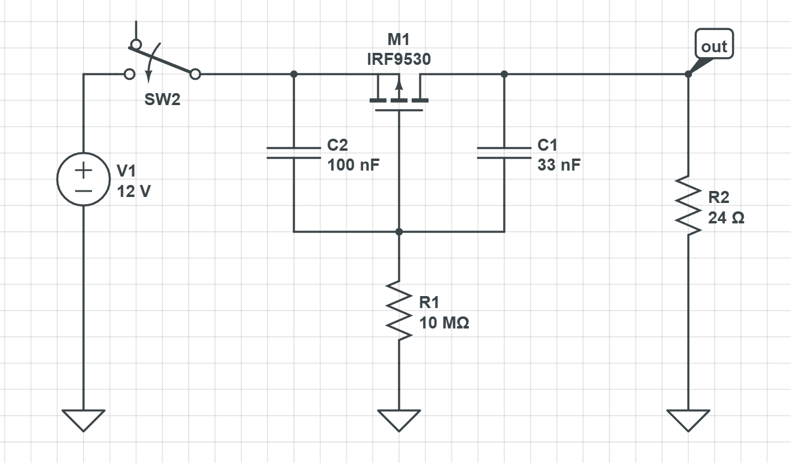

# Soft start circuit

**TL;DR:**
>Presents the significance of inrush current due to high DC bus capacitance from the servo drives. Weighs different soft-start methods.
>**Final chosen method:** Precharge resistor + bypass

**References:**
>- [Mosaic industries mosfet soft start](http://www.mosaic-industries.com/embedded-systems/microcontroller-projects/electronic-circuits/push-button-switch-turn-on/inrush-current-limited-mosfet)
>- [Electronics stack exchange FET soft start](https://electronics.stackexchange.com/questions/645545/12-v-soft-start-circuit)
>- [Pre-charge resistor](https://peccomponents.com/blogs/what-is-a-precharge-resistor-role-applications-benefits/)
>- [Ultimate soft start design guide](https://neurochrome.com/pages/the-ultimate-guide-to-soft-start-design)
>- [Transistor tutorial](https://www.electronics-tutorials.ws/transistor/tran_7.html)

## Inrush current

In a DC circuit, uncharged capacitors initially behaves like a short, drawing an inrush current limited by total series impedance (resistance, ESR, inductance). It charges over ~RC and then blocks DC like an open circuit. The magnitude of inrush current depends on capacitance and source impedance - the larger the capacitance, the larger the surge.

According to the driver datasheet, each BLDC servo drive has about $7500\mu F$ (assuming these are version D.00 drives) of bus capacitance. Multiplied by 2 drivers, the motor power bus sees an effective $15mF$ of capacitance, which is _huge_.

Hence, the inrush current when connecting the drivers straight to the power source is non-negligible and must be safely handled to prevent damaging more sensitive components.

## Soft start circuit

A soft start circuit is used in power electronics to gradually ramp up the input voltage over a short duration to mitigate inrush currents. Below are some common setups:

### 1) NTC resistor 

NTC resistors have relatively high resistance when cool and almost no resistance after heating up.

At startup, the resistor is at room temperature and has high resistance, heavily limiting the surge current flowing throught the circuit and dissipating it as thermal energy. As it heats up, the resistance drops and current increases.

The NTC resistor is effectively a self-regulating surge supressor. However, it dissipated significant heat during operation and requires cool down time after being switched off.

**Pros:**
- Simple design: one 2-terminal part in series, no control logic/sequencing/firmware.
- Self-resetting and passive; cheapest and smallest footprint.

**Cons:**
- Continuous voltage drop + heat. Commodity NTC limiters top out around ~10–25A; required 45A continuous / 90A peak is too high.
- Needs cool-down between cycles, otherwise it has little resistance to clamp current while still hot.
- Inconsistent: limiting varies with ambient temperature

### 2) Precharge resistor + bypass

A circuit where a switch/relay is connected across a precharge resistor near the power input.

During startup, the swtich is open and the precharge resistor is in series, creating a deliberate bottleneck to suppress inrush current.

When the DC bus capacitors are charged up, the switch/relay closes to bypass the precharge resistor, allowing full current flow for normal operation.

**Pros:**
- Resistor only conducts during the brief precharge, then is bypassed; near zero steady-state loss.
- Deterministic: pick R to set precharge current/time exactly; works the same regardless of temperature or how fast you power-cycle.
- Resistor sized for one-shot energy (≈½CV² ≈ 6 J), not continuous load.

**Cons:**
- Needs a voltage comparator (or timer/MCU) to detect and close the bypass.
Close too early (caps not charged) → full inrush through the switch anyway; threshold/timing must be right.
- Failure mode: if the bypass never closes, the resistor sees full load current and burns. Needs thermal margin or a fuse as backstop.
- More parts than the NTC

### 3) P-FET 

At power-on, the P-FET soft start stops the output from snapping up instantly. C2's voltage can't change instantly, when the source jumps to 12V the gate is dragged up with it, so the FET starts parked right at its threshold instead of slamming fully on. 

R1 then slowly bleeds the gate back toward ground, swinging $V_{gs}$ more negative and turning the FET on gradually. As the output rises, C1 (Miller cap) feeds that rising voltage back into the high-impedance gate node, opposing R1's pull-down and holding the gate nearly constant. This negative feedback forces the output to ramp up at a steady, controlled rate (dVout/dt ≈ Vg/(R1·C1). 

This results in a smooth voltage ramp at the output, limiting inrush. C2/R1 set the startup delay, C1/R1 set the ramp speed.

**Pros:**
-Smooth continuous ramp, no relay, inherently soft (no step). Few passives, no MCU.

**Cons:**
- Pass FET stays in the main path permanently and carries full load forever. At 45A that's massive I²R, runs hot continuously.
- Soft-start works by ramping through the linear region. FET dissipates ≈½CV² (~6 J) in its own channel charging 15 mF, secondary-breakdown risk.
- Body diode conducts in the regen direction, not a clean disconnect.
- Fundamentally a low-current technique; doesn't scale to 90A.

## Final decision

The **precharge resistor + bypass** method was chosen as it is the only option where the limiting element is removed from the steady-state path: the NTC can't carry 90A continuously and MOSFETs dissipate too much heat.