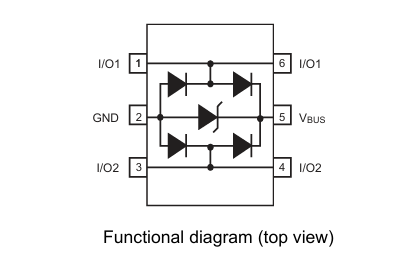

# USB-C ESD protection

**TL;DR:**
>USB type-C connectors require ESD protection due to the tight pin spacings. The USBLC6-2SC6 IC was chosen to protect the data lines.

**References:**
>- [USBLC6-2SC6 datasheet](https://www.st.com/resource/en/datasheet/usblc6-2.pdf)
>- [Digikey USB-C protection guide](https://www.digikey.sg/en/articles/why-usb-type-c-circuit-protection-is-vital)
>- [ST USB-C protection and filtering guide](https://www.st.com/resource/en/application_note/an4871-usb-typec-protection-and-filtering-stmicroelectronics.pdf)

## USB-C failure modes

The USB type-C connector introduces some new failure modes due to it's high power transfer capabilities and tight geometrical design.

Type-C connectors are capable of power delivery up to 240W. The high voltage and current capacity mandates proper reverse polarity/short circuit protection. However, this is not relevant in this project since the USB is only used for communication with the STM32 MCU.

Type-C connectors have 24 pins  compared to the standard 4 pins in type-A connectors. The pin spacing in a type-C connector is about a quarter that in type-A connectors, resulting in an increased risk of shorts if the connector was subjected to twisting, lateral mechanical stress or debris.

## Protection ICs

2 commonly used protection ICs are the TPD8S300 and USBLC6.

TPD8S300 is purpose built for type-C port protection, with overvoltage and internal FETs to prevent VBUS shorts up to 20V. However, it has much higher data line capacitance and is generally only used for USB2.0 or below (<480Mbps).

USBLC6 on the other hand is a general ultra-low capacitance data line protection device that safely clamps ESD transients. It has no VBUS overvoltage/short protection, only data lines. However, it is optimized for high-speed data integrity due to its ultra-low capacitance.

The USBLC6-2SC6 is chosen as power delivery is not used, hence signal integrity and ease of implementation is preferred.

## Pinout

